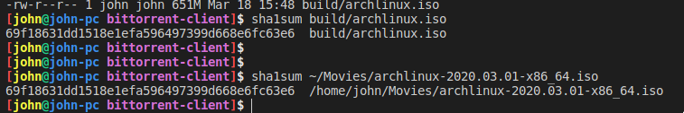

# Bittorrent client

This project implements the bittorrent P2P protocol: https://www.bittorrent.org/beps/bep_0003.html

https://wiki.theory.org/index.php/BitTorrentSpecification

# TODO
- Clean code.
- Test
- Resolve all "todo" comments.
- Fix active workers.
- Make stable.
- Fix code cov (lcov incomplatible with gcc-8?)

# Usage
`torrent-cli [.torrent file] [output file name]`

# Example
`torrent-cli file.torrent output.iso`

First file: Using this client.

Bottom: Using transmission cli daemon.

Sha1Sums match.
